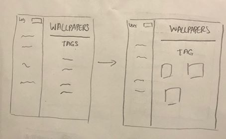
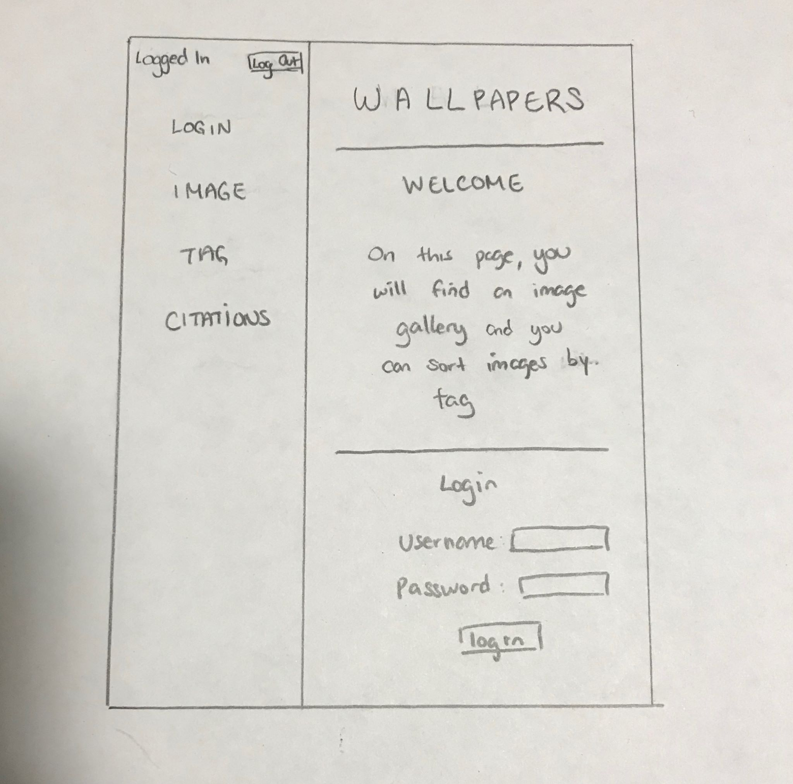
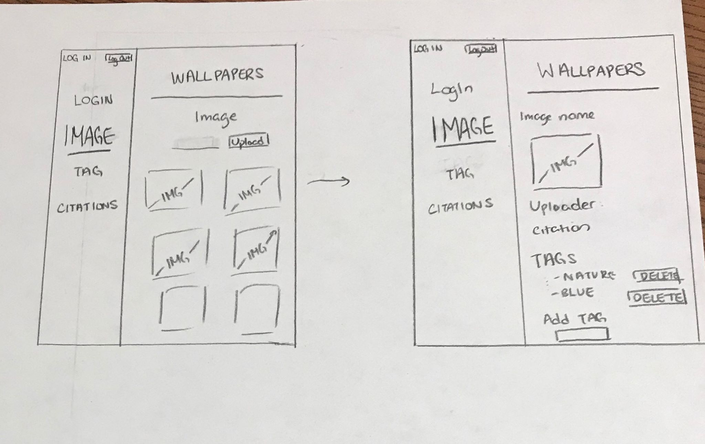
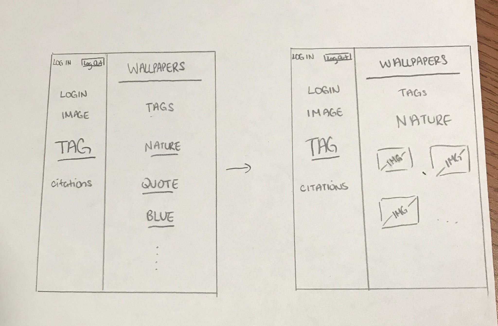
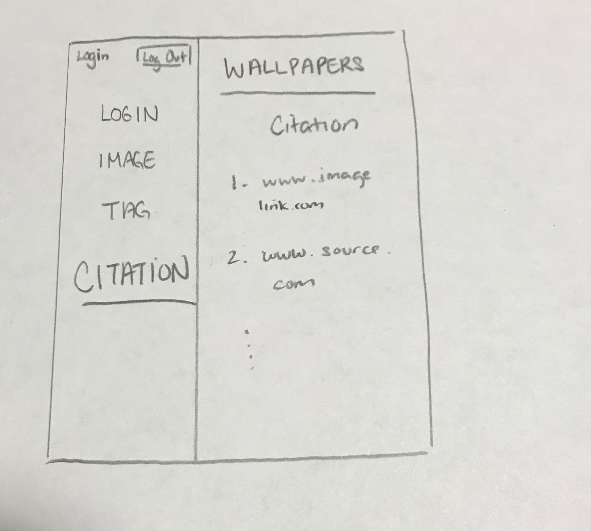

# Project 3 - Design & Plan

Your Name: Iris Zhao

## 1. Persona

I've selected **Abby** as my persona.

I've selected my persona because I think my user preferences are most similar to Abby's. I prefer nice and clean pages with good website feedback. This would be good for Abby since each page really has only one function and there are no hidden buttons. Each page will also have many directions and explanations as well as provide good feedback.

## 2. Sketches & Wireframes

### Sketches





### Wirefames

[Insert your wireframes here.]






This design is good for Abby because pages aren't overwhelmed with functions - each one only does one thing. In addition, with dropdown menus and lists, there is less room for error for Abby. Lastly, there will be plenty of directions and error feedback from each page. Also functions will only be available for users that can do them; for example: delete forms are only visible for uploaders. I think the clear direction and simplicity of my website will be suitable for Abby.

## 3. Database Schema Plan

[Describe the structure of your database. You may use words or a picture. A bulleted list is probably the simplest way to do this.]

Table: login
* field 1: id NOT NULL PK UNIQUE
* field 2: password NOT NULL
* field 3: session_ID

Table: cookie
* field 1: log_in_id NOT NULL
* field 2: expire

Table: image
* field 1: id  NOT NULL PK AUTOINCREMENT
* field 2: name NOT NULL  UNIQUE
* field 3: url NOT NULLL

Table: tag
* field 1: id NOT NULL PK AUTOINCREMENT
* field 2: tag_name NOT NULL UNIQUE

Table: imagetag
* field 1: Image_id NOT NULL
* field 2: Tag_id NOT NULL


## 4. Database Query Plan

[Plan your database queries. You may use natural language, pseudocode, or SQL.]

**Login**
* SELECT password FROM login WHERE id = (username input)

**Image**
* SELECT tag_IDs FROM imagetag WHERE image_id = id

**TAG**
* SELECT image_ID FROM imagetag WHERE tag_id = tag_name

**Insert tag / image**
* INSERT INTO images (image_name, image_url) VALUES (input_name, input_url)

* INSERT INTO tags (tag_id, tag_name) VALUES (input_id, input_name)


**Delete tag / images**
* DELETE FROM images WHERE image_name == input_name
* UPDATE images SET tag_id = NULL


## 5. Structure and Pseudocode

### Structure

[List the PHP files you will have. You will probably want to do this with a bulleted list.]

* index.php - main page, login
* includes/init.php - stuff that useful for every web page.
* includes/header.php - header for every webpage and navbar
* includes/footer.php - footer for every webpage
* images.php - can only access if logged-in, displays all images just picture, click on in picture for their tags
* tag.php - search for images using a form for tags

### Pseudocode

[For each PHP file, plan out your pseudocode. You probably want a subheading for each file.]

#### index.php

```
Pseudocode for index.php...

include init.php

include header.php

Form - Login Username and Password

If username IN ALL usernames
  SELECT password FROM login WHERE id = username
  if (!error)
    create cookie with session
    setcookie ("session", $session, time()+3600)
  else    
    array_push(messages "Username or Password Combination Invalid")

```

#### includes/init.php

```

messages = array to store messages for user (you may remove this)

// DB helper functions (you do not need to write this out since they are provided.)

db = connect to db

$userlog = if (cookie exists)

```


#### init/init.sql

```

all things for creating sql tables

function open_or_init_table
  if table does not exists
    CREATE TABLE
  else
    open table
```


#### includes/header.php

```
nav-bar: foreach page as current page, set CSS id as current page
```

#### includes/footer.php

```
footer: thank you for coming
```

#### images.php

```


if (session cookie exists)
  load page
else
  array_push(messages, 'Please Log In To View Page')

section 1 -display images
SELECT * FROM IMAGES
  Display images from SQL

click each image to see all tags for that images
  SELECT tag_id FROM tagimages WHERE image_ID = Current Image


section 2 - modify images

dropdown menu
  action = insert image
           delete images
           insert tag to image
           delete tag from image

if action = insert image
  INSERT INTO images (name and URL) value (inputs)
elseif action = delete image
  DELETE FROM images WHERE name = input values
elseif action = insert tag
  tags = SELECT tag_name FROM tags
  If ($_GET[$taginput]) in tags array
    add tag to images
  else
    INSERT INTO tags (tag_id, tagnames) value (inputs)
    add tag to image
elseif action = delete tag from image
  SELECT tag_ids FROM imagetag WHERE image = image_id
    if (tag in tag_ids array)
      DELETE FROM images where image_id = image
    else
      array_push(messages, 'No tag on image currently');

```

#### tag.php

```
if (session cookie exists)
  load pages
else
  array_push(message, "Please Log IN To View This Page")

Search Form for Tag

SELECT image_id FROM tagimages WHERE tag = search tag
  Foreach Image_id
    Display Image


```

## 6. Seed Data - Username & Passwords

[List the usernames and passwords for your users]

* Tester: puppy
* Iris: penguin

## CHANGES MADE
* I added a citations page to make the citations for the images easier.

* Changed the user access so to fulfill project requirements - all individuals (instead of only logged in people) can upload tags
